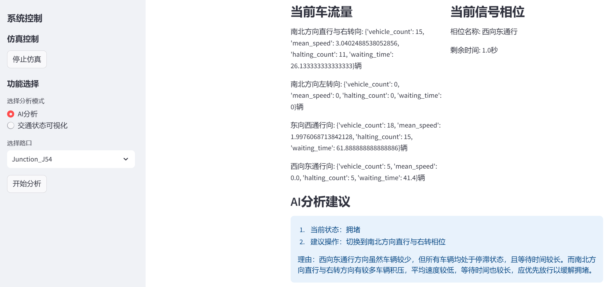
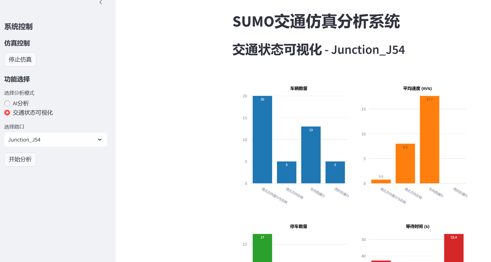

# SUMO Traffic Simulation Analysis System

一个基于SUMO（Simulation of Urban MObility）的交通仿真分析系统，集成了AI分析和实时可视化功能，帮助交通工程师更好地理解和优化交通流量。

## 功能特点

- **实时交通仿真**：基于SUMO进行微观交通仿真，支持复杂路网模拟
- **AI辅助分析**：集成Qwen大模型，提供专业的交通状态分析和优化建议
- **实时数据可视化**：使用Plotly绘制直观的交通流量图表
- **交互式界面**：基于Streamlit构建的用户友好界面
- **多路口监控**：支持同时监控多个信号交叉口

## 界面展示

### SUMO仿真界面


### AI分析界面



*功能一展示实时交通状态和AI分析结果*

### 统计可视化界面



*功能二统计图表*

### AI大模型对话界面
前端web页面项目：https://gitee.com/wen-qiang-leo/sumo-ai/tree/ai-web/


*功能三展示大模型对话*

## 技术栈

- SUMO：交通仿真引擎
- Python：主要开发语言
- Streamlit：Web界面框架
- Plotly：数据可视化
- Qwen：AI分析模型

## 环境配置

### SUMO安装

1. 从[SUMO官网](https://sumo.dlr.de/docs/Downloads.php)下载并安装SUMO
2. 设置环境变量：
   - Windows: 将SUMO安装目录添加到PATH
   - Linux/Mac: export SUMO_HOME="/usr/local/share/sumo"
   - Mac: export SUMO_HOME="/Users/leida/Cline/sumo/bin"

### Python依赖

```bash
#克隆项目
git clone https://gitee.com/wen-qiang-leo/mcp_sumo_fastapi_llm.git
cd mcp_sumo_fastapi_llm
# 创建并激活虚拟环境
pip install uv
uv venv

source .venv/bin/activate  # Linux/Mac
# 或
.venv\Scripts\activate  # Windows

# 安装依赖
uv sync # 安装pyproject.toml中的所有依赖 
```

### 运行程序

```
# 最先手动启动XQuartz (sumo server)

# 先启动mcp服务和sumo仿真
source .venv/bin/activate
export SUMO_HOME="/Users/leida/Cline/sumo/bin"
uv run python api_server/mcp_server/mcp_server.py

#再启动后端服务
source .venv/bin/activate
export SUMO_HOME="/Users/leida/Cline/sumo/bin"
uv run main.py

# Web前端
source .venv/bin/activate
export SUMO_HOME="/Users/leida/Cline/sumo/bin"
streamlit run sumo_llm/app.py

# 环境变量
ANTHROPIC_API_KEY=sk-
DASHSCOPE_API_KEY=sk-
MODEL_NAME=qwen-plus-0806

```

## 未来改进计划

1. **Agent功能扩展**
   - 添加function calling功能
   - 根据LLM分析结果，规范化输出，直接控制交叉口
   - 添加多智能体模型框架，根据交通状况调用不同的控制算法
2. **高级可视化功能**
   - 添加热力图展示交通拥堵状况
   - 支持历史数据回放功能
   - 连接高德，增加3D路网可视化
