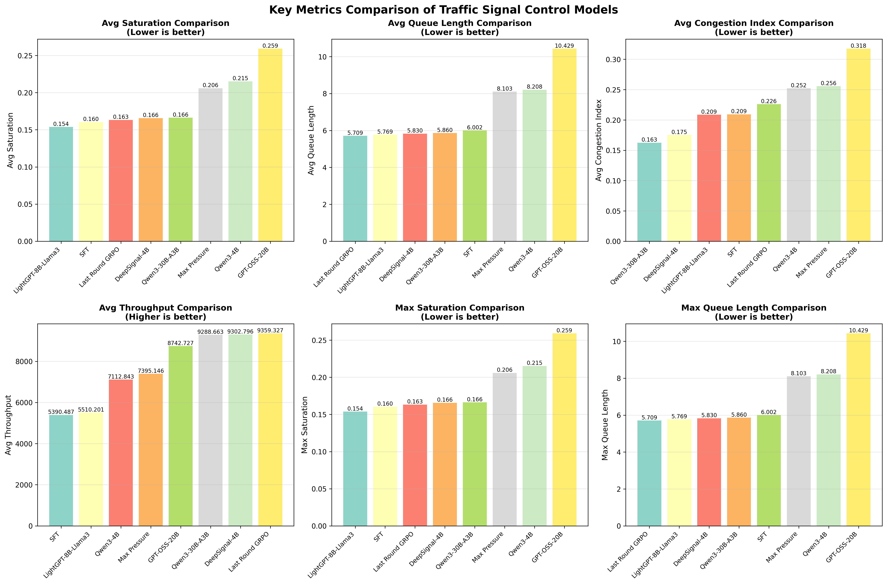

# DeepSignal（SUMO + MCP）——交通信号控制大模型

[English README](README.md)

DeepSignal 是我们自主微调的交通信号控制大模型，当前发布版本为 **DeepSignal-4B**。

- **模型地址（Hugging Face）**：[`AIMS2025/DeepSignal`](https://huggingface.co/AIMS2025/DeepSignal)

本仓库同时包含基于 SUMO 的仿真评估环境与 MCP Server，用于让大模型与交通仿真进行闭环交互。

## 核心思路：离线学习 + 在线学习

我们采用“离线 + 在线”的两阶段微调流程：

- **离线学习（SFT）**：监督微调，让模型学会交通状态分析、控制策略建议、输出格式约束等。
- **在线学习（RL + SUMO 交互）**：模型在 SUMO 仿真中与环境交互，通过强化学习进一步优化信号控制决策。

## 场景（训练 vs 未参与训练的评估）

在线交互训练使用 `scenarios/` 目录下的多个城市/路网场景；评估时我们使用**未参与训练（hold-out）**的场景，在 SUMO 中做仿真评估以检验泛化能力。

| 城市/区域 | 场景目录 | 配置文件 | 用途 | 备注 |
|---|---|---|---|---|
| Bad Hersfeld | `BadHersfeld_osm_duarouter` | `duarouter.sumocfg` | 训练 | OSM + duarouter |
| Bad Hersfeld | `BadHersfeld_osm_osm` | `osm.sumocfg` | 训练 | OSM |
| Bad Hersfeld | `BadHersfeld_prt_src_prt` | `prt.sumocfg` | 训练 | PRT |
| Bologna | `bologna_acosta_persontrips_run` | `run.sumocfg` | 训练 | Acosta (persontrips) |
| Bologna | `bologna_acosta_run` | `run.sumocfg` | 训练 | Acosta |
| Bologna | `bologna_joined_run` | `run.sumocfg` | 训练 | Joined |
| Bologna | `bologna_pasubio_run` | `run.sumocfg` | 训练 | Pasubio |
| Doerpfeldstr | `Doerpfeldstr_all_modes` | `all_modes.sumocfg` | 训练 | 多模式 |
| Doerpfeldstr | `Doerpfeldstr_output` | `output.sumocfg` | 训练 | Output config |
| Doerpfeldstr | `Doerpfeldstr_output_flows` | `output_flows.sumocfg` | 训练 | Flows |
| Doerpfeldstr | `Doerpfeldstr_output_neu` | `output_neu.sumocfg` | 训练 | Output (neu) |
| Germany motorways | `germany-motorways_run` | `run.sumocfg` | 训练 | 高速路网 |
| PORT tutorial | `port_tutorials_port_brunswick_osm` | `osm.sumocfg` | 训练 | Brunswick OSM |
| PORT tutorial | `port_tutorials_port_l_beck_port_tutorial` | `port_tutorial.sumocfg` | 训练 | Lübeck tutorial |
| Wildau | `Wildau_flow1_Spaet` | `flow1_Spaet.sumocfg` | 训练 | 流量配置 |
| Cologne | `cologne1` | `cologne1.sumocfg` | 评估（hold-out） | 未参与训练 |
| Cologne | `cologne3` | `cologne3.sumocfg` | 评估（hold-out） | 未参与训练 |
| Cologne | `cologne8` | `cologne8.sumocfg` | 评估（hold-out） | 未参与训练 |
| Ingolstadt | `ingolstadt1` | `ingolstadt1.sumocfg` | 评估（hold-out） | 未参与训练 |
| Ingolstadt | `ingolstadt21` | `ingolstadt21.sumocfg` | 评估（hold-out） | 未参与训练 |
| Ingolstadt | `ingolstadt7` | `ingolstadt7.sumocfg` | 评估（hold-out） | 未参与训练 |
| Chengdu | `sumo_llm` | `osm.sumocfg` | 评估（test-only） | 仅测试；不参与微调训练 |

## 评估指标

我们在 SUMO 仿真中对路口进行评估，核心指标包括：

- **平均饱和度**（`average_saturation`）
- **平均排队长度**（`average_queue_length`）
- **最大饱和度**（`max_saturation`）
- **最大排队长度**（`max_queue_length`）
- **拥堵指数（0–1）**（`congestion_index`）
- **拥堵等级**（`congestion_level`，并统计其分布百分比）

## 结果（指标对比）

### 不同模型的指标对比表

| 模型 | 平均饱和度 | 平均排队长度 | 最大饱和度 | 最大排队长度 | 平均拥堵指数 |
|---|---:|---:|---:|---:|---:|
| [`Qwen3-30B-A3B`](https://huggingface.co/Qwen/Qwen3-VL-30B-A3B-Instruct) | 0.1663 | 5.8604 | 0.1663 | 5.8604 | 0.1625 |
| DeepSignal-4B (Ours) | 0.1657 | 5.8301 | 0.1657 | 5.8301 | 0.1752 |
| [`LightGPT-8B-Llama3`](https://huggingface.co/lightgpt/LightGPT-8B-Llama3) | 0.1538 | 5.7688 | 0.1538 | 5.7688 | 0.2086 |
| Qwen3-4B-SFT | 0.1604 | 6.0021 | 0.1604 | 6.0021 | 0.2093 |
| [`Qwen3-4B`](https://huggingface.co/Qwen/Qwen3-4B-Instruct-2507) | 0.2152 | 8.2083 | 0.2152 | 8.2083 | 0.2522 |
| Max Pressure | 0.2059 | 8.1034 | 0.2059 | 8.1034 | 0.2556 |
| [`GPT-OSS-20B`](https://huggingface.co/openai/gpt-oss-20b) | 0.2591 | 10.4292 | 0.2591 | 10.4292 | 0.3175 |

### 不同模型的拥堵等级分布（%）

| 模型 | 轻度拥堵 | 畅通 | 非常畅通 |
|---|---:|---:|---:|
| DeepSignal-4B (Ours) | 0.00 | 12.00 | 88.00 |
| [`GPT-OSS-20B`](https://huggingface.co/openai/gpt-oss-20b) | 2.00 | 53.33 | 44.67 |
| [`LightGPT-8B-Llama3`](https://huggingface.co/lightgpt/LightGPT-8B-Llama3) | 0.00 | 21.00 | 79.00 |
| Max Pressure | 0.00 | 36.44 | 63.56 |
| [`Qwen3-30B-A3B`](https://huggingface.co/Qwen/Qwen3-VL-30B-A3B-Instruct) | 0.00 | 10.00 | 90.00 |
| [`Qwen3-4B`](https://huggingface.co/Qwen/Qwen3-4B-Instruct-2507) | 2.33 | 32.00 | 65.67 |
| Qwen3-4B-SFT | 0.00 | 23.33 | 76.67 |

### 可视化对比图



## 模型文件（GGUF）与本地推理

如果你需要 GGUF 文件用于本地推理（`llama.cpp` / LM Studio），可参考 Hugging Face 模型卡以及 `hf/` 目录说明。

示例（llama.cpp）：

```bash
llama-cli -m DeepSignal-4B_V1.F16.gguf -p "Summarize the traffic state and suggest a signal timing adjustment."
```

## 环境配置

### SUMO 安装

1. 从 SUMO 官网下载并安装：<https://sumo.dlr.de/docs/Downloads.php>
2. 设置 `SUMO_HOME`（示例）：
   - Linux/Mac：`export SUMO_HOME="/usr/local/share/sumo"`
   - Mac（示例）：`export SUMO_HOME="/Users/<you>/sumo/bin"`

### Python 依赖（uv）

```bash
pip install uv
uv venv
source .venv/bin/activate
uv sync
```

## 评估流程（可复现）

评估在 SUMO 仿真中进行，并将指标以 CSV 形式记录到 `results/` 目录。

### 启动 MCP Server + SUMO 仿真

```bash
source .venv/bin/activate
export SUMO_HOME="/Users/<you>/sumo/bin"
uv run python api_server/mcp_server/mcp_server.py
```

### 查看/选择场景与信号灯（TL IDs）

```bash
# 列出 ./scenarios 下可用场景
uv run python api_server/mcp_server/mcp_server.py --list-scenarios

# 列出某个场景里可选的信号灯（TL IDs）
uv run python api_server/mcp_server/mcp_server.py --scenario Doerpfeldstr_all_modes --list-tl-ids

# 切换到某个场景（自动选择目录下的 .sumocfg）
uv run python api_server/mcp_server/mcp_server.py --scenario Doerpfeldstr_all_modes

# 显式指定 .sumocfg（当目录里有多个 .sumocfg 时推荐）
uv run python api_server/mcp_server/mcp_server.py --sumocfg scenarios/Doerpfeldstr_all_modes/all_modes.sumocfg

# 可选：指定路口 TL ID、禁用 GUI、禁用后台自动优化
uv run python api_server/mcp_server/mcp_server.py --scenario Doerpfeldstr_all_modes --tl-id J54 --nogui --no-auto-optimize
```

### 评估输出

- 指标 CSV 示例：`results/intersection_metrics_*.csv`
- 对比分析 Notebook：`traffic_control_comparison.ipynb`
- 上方柱状图文件：`images/metrics_comparison_bars.png`

## UI


