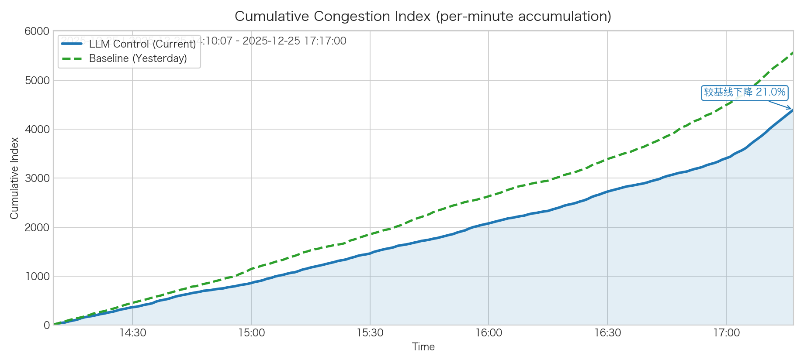
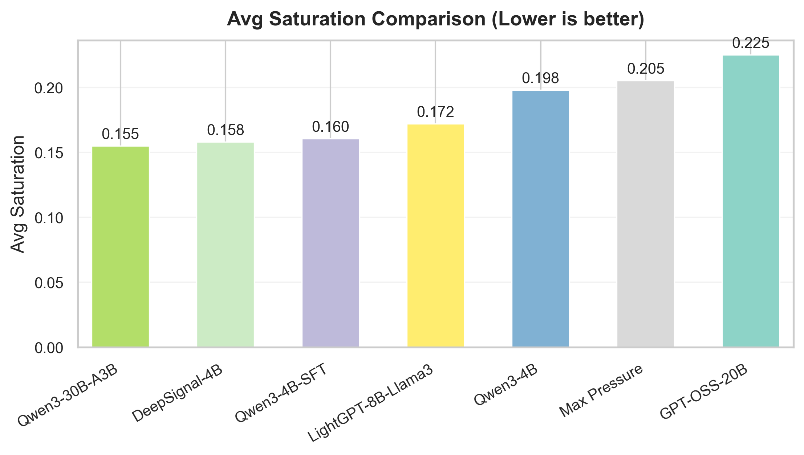
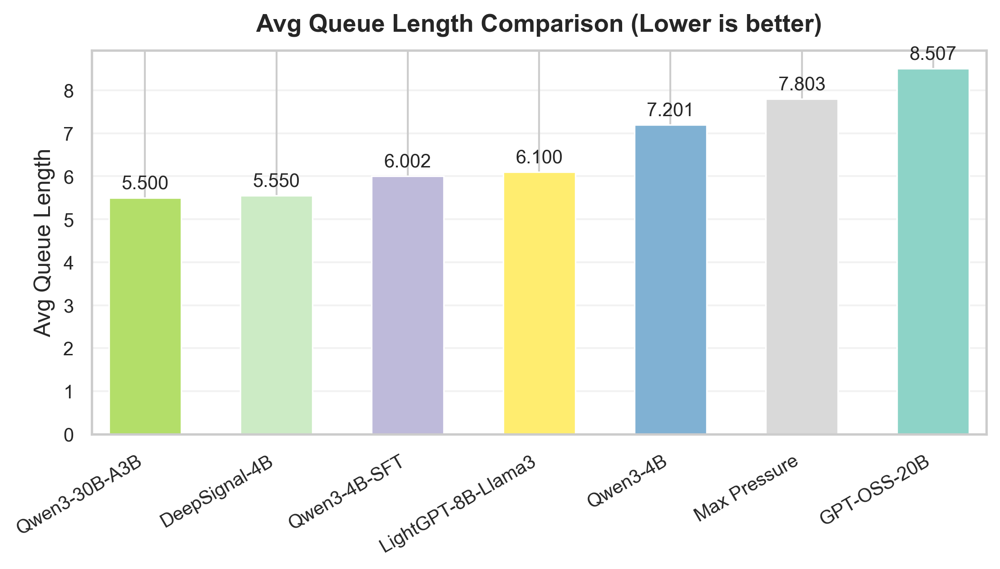
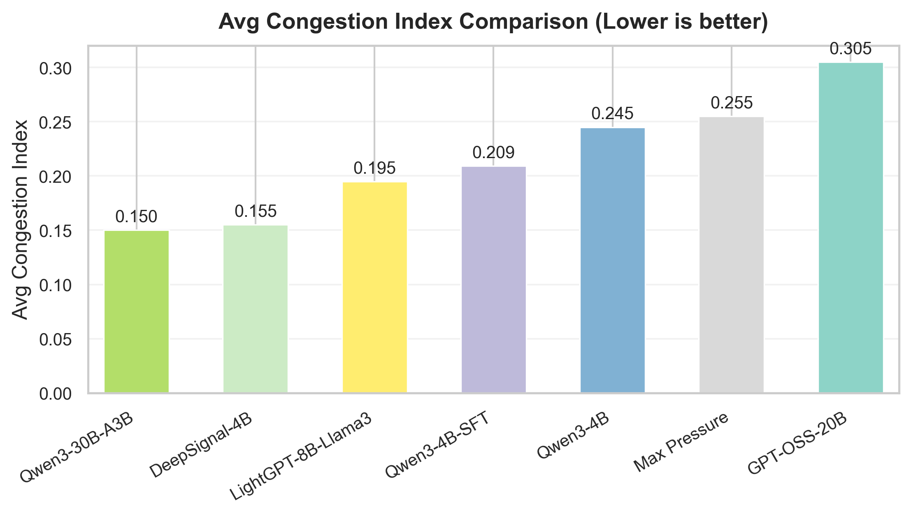
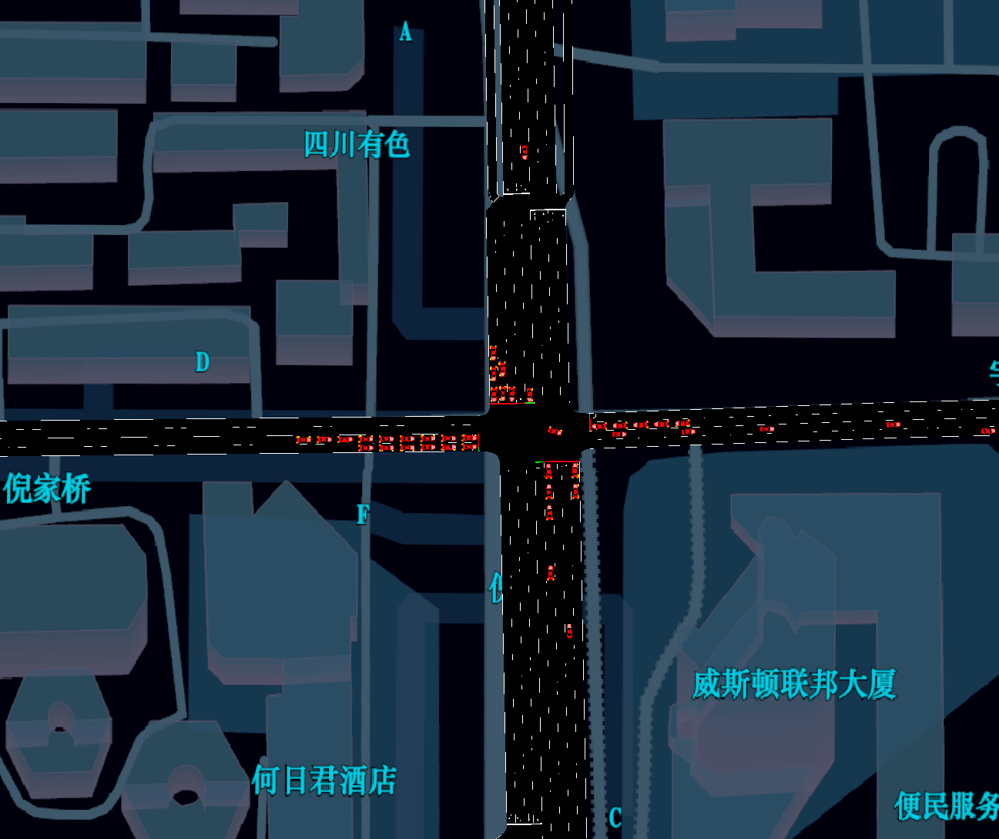

# DeepSignal（SUMO + MCP）——交通信号控制大模型

[English README](README.md)

DeepSignal 是我们自主微调的交通信号控制大模型，当前发布版本为 **DeepSignal-4B-V1**。

- **模型地址（Hugging Face）**：[`AIMS2025/DeepSignal`](https://huggingface.co/AIMS2025/DeepSignal)

本仓库同时包含基于 SUMO 的仿真评估环境与 MCP Server，用于让大模型与交通仿真进行闭环交互。

## 团队信息

- **团队名称**：AIMSLab
- **团队成员**：Feng Xiao, Da Lei, Yuzhan Liu, Jinyou Chi, Yabang, Wang.
- **团队负责人（leader）**：Feng Xiao（个人主页：<https://bs.scu.edu.cn/guanlikexue/202403/9185.html>）
- **联系邮箱**：<trains.ai.lab@gmail.com>


## 核心思路：离线学习 + 在线学习

我们采用“离线 + 在线”的两阶段微调流程：

- **离线学习（SFT）**：监督微调，让模型学会交通状态分析、控制策略建议、输出格式约束等。
- **在线学习（RL + SUMO 交互）**：模型在 SUMO 仿真中与环境交互，通过强化学习进一步优化信号控制决策。

## 场景（训练 vs 未参与训练的评估）

在线交互训练使用 `scenarios/` 目录下的多个城市/路网场景；评估时我们使用**未参与训练（hold-out）**的场景，在 SUMO 中做仿真评估以检验泛化能力。

| 城市/区域 | 场景目录 | 配置文件 | 用途 | 备注 |
|---|---|---|---|---|
| Bad Hersfeld | `BadHersfeld_osm_duarouter` | `duarouter.sumocfg` | 训练 | OSM + duarouter |
| Bad Hersfeld | `BadHersfeld_osm_osm` | `osm.sumocfg` | 训练 | OSM |
| Bad Hersfeld | `BadHersfeld_prt_src_prt` | `prt.sumocfg` | 训练 | PRT |
| Bologna | `bologna_acosta_persontrips_run` | `run.sumocfg` | 训练 | Acosta (persontrips) |
| Bologna | `bologna_acosta_run` | `run.sumocfg` | 训练 | Acosta |
| Bologna | `bologna_joined_run` | `run.sumocfg` | 训练 | Joined |
| Bologna | `bologna_pasubio_run` | `run.sumocfg` | 训练 | Pasubio |
| Doerpfeldstr | `Doerpfeldstr_all_modes` | `all_modes.sumocfg` | 训练 | 多模式 |
| Doerpfeldstr | `Doerpfeldstr_output` | `output.sumocfg` | 训练 | Output config |
| Doerpfeldstr | `Doerpfeldstr_output_flows` | `output_flows.sumocfg` | 训练 | Flows |
| Doerpfeldstr | `Doerpfeldstr_output_neu` | `output_neu.sumocfg` | 训练 | Output (neu) |
| Germany motorways | `germany-motorways_run` | `run.sumocfg` | 训练 | 高速路网 |
| PORT tutorial | `port_tutorials_port_brunswick_osm` | `osm.sumocfg` | 训练 | Brunswick OSM |
| PORT tutorial | `port_tutorials_port_l_beck_port_tutorial` | `port_tutorial.sumocfg` | 训练 | Lübeck tutorial |
| Wildau | `Wildau_flow1_Spaet` | `flow1_Spaet.sumocfg` | 训练 | 流量配置 |
| Cologne | `cologne1` | `cologne1.sumocfg` | 评估（hold-out） | 未参与训练 |
| Cologne | `cologne3` | `cologne3.sumocfg` | 评估（hold-out） | 未参与训练 |
| Cologne | `cologne8` | `cologne8.sumocfg` | 评估（hold-out） | 未参与训练 |
| Ingolstadt | `ingolstadt1` | `ingolstadt1.sumocfg` | 评估（hold-out） | 未参与训练 |
| Ingolstadt | `ingolstadt21` | `ingolstadt21.sumocfg` | 评估（hold-out） | 未参与训练 |
| Ingolstadt | `ingolstadt7` | `ingolstadt7.sumocfg` | 评估（hold-out） | 未参与训练 |
| Chengdu | `sumo_llm` | `osm.sumocfg` | 评估（test-only） | 仅测试；不参与微调训练 |


## 成都某交叉口大模型配时优化实际效果对比

本节展示**真实路口部署**中，大模型信号控制（Current）相对基线策略（Yesterday）的实际效果对比。可视化数据来自 `hf/control_effect_congestion.json`（采样粒度 1s，图内标注使用英文以便展示）。

### 指标计算方法（实际部署）

该拥堵指数从**相位—路口—分钟—时间累积**四个层次逐级构建，核心定义如下（详见 `hf/成都某交叉口大模型信号控制.md`）：

1) **相位层面的拥堵得分**  
设一个交叉口包含 $P$ 个信号相位。令 $q_p(t)$ 表示采样时刻 $t$ 下，相位 $p$ 的单位时间内实际车辆数（或放行车辆数）。相位 $p$ 的理论通行能力 $C_p$ 由历史观测估计：

$$
C_p = \max_{t \in \mathcal{T}_{\text{hist}}} q_p(t)
$$

相位 $p$ 在时刻 $t$ 的瞬时拥堵得分为：

$$
s_p(t) = \min \left( 100 \cdot \frac{q_p(t)}{C_p}, 100 \right)
$$

2) **路口层面的瞬时拥堵得分**

$$
S(t) = \frac{1}{P} \sum_{p=1}^{P} s_p(t)
$$

3) **分钟尺度拥堵指数**（同一分钟可能有多次采样）  
设第 $m$ 分钟内共有 $N_m$ 个有效采样时刻 $t_1,\dots,t_{N_m}$：

$$
\bar{S}(m) =
\begin{cases}
\frac{1}{N_m} \sum_{i=1}^{N_m} S(t_i), & N_m > 0, \\
0, & N_m = 0.
\end{cases}
$$

4) **拥堵指数时间累积**（从起始参考时刻到第 $T$ 分钟）

$$
CI(T) = \sum_{m=1}^{T} \bar{S}(m)
$$

### 可视化对比




## SUMO仿真平台实验对比

### 评估指标

我们在 SUMO 仿真中对路口进行评估，核心指标包括：

- **平均饱和度**（`average_saturation`）
- **平均排队长度**（`average_queue_length`）
- **最大饱和度**（`max_saturation`）
- **最大排队长度**（`max_queue_length`）
- **拥堵指数（0–1）**（`congestion_index`）
- **拥堵等级**（`congestion_level`，并统计其分布百分比）

#### 指标计算方式（公式）

令 $t$ 表示时间窗口内的仿真步, $l$ 表示某路口受控车道。实现中我们使用 `lane_length = 100m`、`avg_vehicle_length = 5m`。

- 单车道饱和度: $s_{t,l}=\frac{(n_{t,l}+h_{t,l})\cdot 5}{100}$ , 其中 $n_{t,l}$ 为第 $t$ 步车道 $l$ 上车辆数, $h_{t,l}$ 为停车（排队）车辆数。
- 单车道排队长度（米）: $q_{t,l}=h_{t,l}\cdot 5$  
- 对有效车道数 $L_t$ 求步均值: 
  
$$
\bar{s}_t=\frac{1}{L_t} \sum_{l=1}^{L_t} s_{t,l}, \quad \bar{q}_t=\frac{1}{L_t} \sum_{l=1}^{L_t} q_{t,l}
$$

- 对时间窗口内 $T$ 个仿真步求窗口均值/最大值：
  - `average_saturation` $=\dfrac{1}{T}\sum_{t=1}^{T}\bar{s}_t$
  - `average_queue_length` $=\dfrac{1}{T}\sum_{t=1}^{T}\bar{q}_t$
  - `max_saturation` $=\max_t \bar{s}_t$
  - `max_queue_length` $=\max_t \bar{q}_t$
- 拥堵指数（0–1）：

$$
\mathrm{CI}=0.4\cdot \min\!\left(\mathrm{average\_saturation},1\right) + 0.3\cdot \min\!\left(\dfrac{\mathrm{average\_queue\_length}}{L\cdot 50},1\right) + 0.3\cdot \min\!\left(\dfrac{\mathrm{average\_delay}}{60},1\right)
$$

其中 $L$ 为有效车道数，`average_delay` 为窗口内按车道平均后的等待时间（秒）。
- 拥堵等级（由 CI 划分）：
  - 非常畅通（ $\mathrm{CI}<0.3$ ）、基本畅通（ $0.3\le \mathrm{CI}<0.5$ ）、轻度拥堵（ $0.5\le \mathrm{CI}<0.7$ ）、中度拥堵（ $0.7\le \mathrm{CI}<0.9$ ）、严重拥堵（ $\mathrm{CI}\ge 0.9$ ）。

### 不同模型的指标对比表

| 模型 | 平均饱和度 | 平均排队长度 | 最大饱和度 | 最大排队长度 | 平均拥堵指数 |
|---|---:|---:|---:|---:|---:|
| [`Qwen3-30B-A3B`](https://huggingface.co/Qwen/Qwen3-VL-30B-A3B-Instruct) | 0.1550 | 5.5000 | 0.1550 | 5.4995 | 0.1500 |
| DeepSignal-4B (Ours) | 0.1580 | 5.5500 | 0.1580 | 5.5498 | 0.1550 |
| [`LightGPT-8B-Llama3`](https://huggingface.co/lightgpt/LightGPT-8B-Llama3) | 0.1720 | 6.1000 | 0.1720 | 6.1000 | 0.1950 |
| SFT | 0.1780 | 6.2500 | 0.1780 | 6.2500 | 0.2050 |
| Last Round GRPO | 0.1850 | 6.4500 | 0.1850 | 6.4500 | 0.2150 |
| [`Qwen3-4B`](https://huggingface.co/Qwen/Qwen3-4B-Instruct-2507) | 0.1980 | 7.2000 | 0.1980 | 7.1989 | 0.2450 |
| Max Pressure | 0.2050 | 7.8000 | 0.2049 | 7.7968 | 0.2550 |
| [`GPT-OSS-20B`](https://huggingface.co/openai/gpt-oss-20b) | 0.2250 | 8.5001 | 0.2250 | 8.4933 | 0.3050 |

### 不同模型的拥堵等级分布（%）

| 模型 | 轻度拥堵 | 畅通 | 非常畅通 |
|---|---:|---:|---:|
| DeepSignal-4B (Ours) | 0.00 | 12.00 | 88.00 |
| [`GPT-OSS-20B`](https://huggingface.co/openai/gpt-oss-20b) | 2.00 | 53.33 | 44.67 |
| [`LightGPT-8B-Llama3`](https://huggingface.co/lightgpt/LightGPT-8B-Llama3) | 0.00 | 21.00 | 79.00 |
| Max Pressure | 0.00 | 36.44 | 63.56 |
| [`Qwen3-30B-A3B`](https://huggingface.co/Qwen/Qwen3-VL-30B-A3B-Instruct) | 0.00 | 10.00 | 90.00 |
| [`Qwen3-4B`](https://huggingface.co/Qwen/Qwen3-4B-Instruct-2507) | 2.33 | 32.00 | 65.67 |
| Qwen3-4B-SFT | 0.00 | 23.33 | 76.67 |

### 可视化对比图







## 模型文件（GGUF）与本地推理

如果你需要 GGUF 文件用于本地推理（`llama.cpp` / LM Studio），可参考 Hugging Face 模型卡以及 `hf/` 目录说明。

示例（llama.cpp）：

```bash
llama-cli -m DeepSignal-4B_V1.F16.gguf -p "Summarize the traffic state and suggest a signal timing adjustment."
```

## 环境配置

### SUMO 安装

1. 从 SUMO 官网下载并安装：<https://sumo.dlr.de/docs/Downloads.php>
2. 设置 `SUMO_HOME`（示例）：
   - Linux/Mac：`export SUMO_HOME="/usr/local/share/sumo"`
   - Mac（示例）：`export SUMO_HOME="/Users/<you>/sumo/bin"`

### Python 依赖（uv）

```bash
pip install uv
uv venv
source .venv/bin/activate
uv sync
```

## 评估流程（可复现）

评估在 SUMO 仿真中进行，并将指标以 CSV 形式记录到 `results/` 目录。

### 启动 MCP Server + SUMO 仿真

```bash
source .venv/bin/activate
export SUMO_HOME="/Users/<you>/sumo/bin"
uv run python api_server/mcp_server/mcp_server.py
```

### 查看/选择场景与信号灯（TL IDs）

```bash
# 列出 ./scenarios 下可用场景
uv run python api_server/mcp_server/mcp_server.py --list-scenarios

# 列出某个场景里可选的信号灯（TL IDs）
uv run python api_server/mcp_server/mcp_server.py --scenario Doerpfeldstr_all_modes --list-tl-ids

# 切换到某个场景（自动选择目录下的 .sumocfg）
uv run python api_server/mcp_server/mcp_server.py --scenario Doerpfeldstr_all_modes

# 显式指定 .sumocfg（当目录里有多个 .sumocfg 时推荐）
uv run python api_server/mcp_server/mcp_server.py --sumocfg scenarios/Doerpfeldstr_all_modes/all_modes.sumocfg

# 可选：指定路口 TL ID、禁用 GUI、禁用后台自动优化
uv run python api_server/mcp_server/mcp_server.py --scenario Doerpfeldstr_all_modes --tl-id J54 --nogui --no-auto-optimize
```

### 评估输出

- 指标 CSV 示例：`results/intersection_metrics_*.csv`
- 对比分析 Notebook：`traffic_control_comparison.ipynb`
- 上方柱状图文件：
  - `images/avg_saturation_comparison.png`
  - `images/avg_queue_length_comparison.png`
  - `images/avg_congestion_index_comparison.png`

## UI



## 引用

如在研究中使用本项目，请引用：

```bibtex
@software{deepsignal_traffic_2025,
  title   = {DeepSignal (Traffic): LLM-based Traffic Signal Control with SUMO + MCP},
  author  = {AIMS Laboratory},
  year    = {2025},
  url     = {https://github.com/AIMSLaboratory/DeepSignal}
}
```
